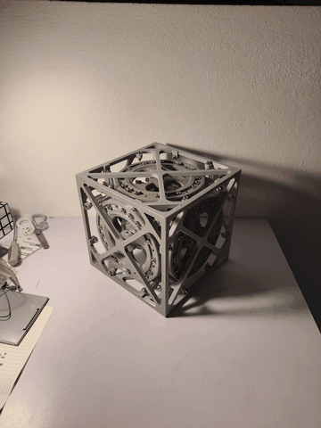
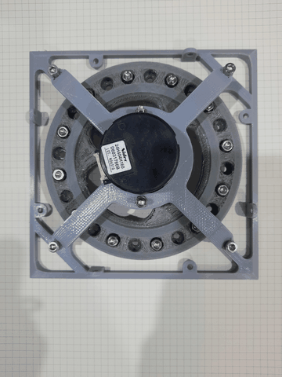

# balancing-cube-pendulum

A cube-shaped inverted pendulum that balances on one of its **edges** or on its **vertex** using three reaction wheels. An ESP32 reads an MPU6050 IMU, runs a state-feedback (LQR-style) controller every 10 ms and drives three BLDC motors with flywheels. Gains can be tuned and balancing points calibrated live over Bluetooth.

<p align="center">
  
  &nbsp;&nbsp;
  
</p>

<p align="center"><b>▶ Full demo videos:</b> <a href="https://drive.google.com/drive/u/1/folders/1OIPeiEGu_qAjH-schkNBbWfEO3ckcJUU">Google Drive folder</a> &nbsp;·&nbsp; <b>🧊 3D model:</b> <a href="https://drive.google.com/drive/folders/1N-OwwTjmH3r523ASoxteu_BQdPYT6DqE?usp=sharing">Google Drive folder</a></p>

> The GIFs above are built from the photos in [`model/`](model). The balancing videos themselves are in the Drive folder.

---

## Repository contents

| Folder / file | What it is |
|---|---|
| [`Code/`](Code) | **Our team's sketches**, in development order (comments in Vietnamese). See [Sketches in `Code/`](#sketches-in-code). |
| [`ESP32_controller/`](ESP32_controller) | Reference ESP32 firmware (no encoders): `ESP32_cube.ino` main loop, `functions.ino` (IMU, motors, Bluetooth tuning), `ESP32.h` pins and gains, plus `schematic.pdf`. |
| [`esp32_encoders/`](esp32_encoders) | Reference ESP32 firmware for motors **with** encoder feedback, plus `schematic.png`. |
| [`arduino_nano_controller/`](arduino_nano_controller) | Reference firmware for an Arduino Nano build (tuning over USB serial instead of Bluetooth), plus `arduino_schematic.pdf`. |
| [`motors_test/`](motors_test) | Stand-alone sketch that spins each motor and reads its encoder, for checking wiring before balancing. |
| [`model/`](model) | Photos of the mechanical build and the finished cube balancing (Nov 2022). The 3D model files are on [Google Drive](https://drive.google.com/drive/folders/1N-OwwTjmH3r523ASoxteu_BQdPYT6DqE?usp=sharing). |
| [`Reports/`](Reports) | Course report (`.docx`) and presentation slides (`.pptx` / `.pdf`). |
| [`VTCB.xlsx`](VTCB.xlsx) | Measured IMU angles at each balancing point (*VTCB = vị trí cân bằng*, "balancing position"). See [Balancing point data](#balancing-point-data). |
| `docs/` | GIFs used in this README. |

The reference firmware in `ESP32_controller/`, `esp32_encoders/`, `arduino_nano_controller/` and `motors_test/` comes from **[remrc/Self-Balancing-Cube](https://github.com/remrc/Self-Balancing-Cube)**. Our sketches in `Code/` are based on it.

### Sketches in `Code/`

| Sketch | Purpose |
|---|---|
| `sketch_nov6a_motor_test.ino` | Steps each motor through ±10 and ±30 PWM to check direction and wiring. |
| `sketch_nov6a_motor_stop.ino` | Holds all motors at 0 with the brake engaged (safe state). |
| `sketch_nov18a_all_readmpu_getbpoint.ino` | Full controller with **motor outputs disabled**. It prints `AngleX` / `AngleY` to the serial monitor, which is how the balancing points in `VTCB.xlsx` were recorded. |
| `sketch_nov21a_all.ino` | First full controller with motor outputs enabled (calibration windows from the reference firmware). |
| `sketch_nov26a_all_gotbp_runpcd.ino` | **Recommended.** Latest version, with the measured balancing points from `VTCB.xlsx` hard-coded as defaults and calibration windows matched to our cube. |

---

## Hardware

- ESP32 dev board
- MPU6050 IMU (I²C, address `0x68`)
- 3 × BLDC motors with built-in driver (e.g. Nidec 24H), each with a reaction flywheel
- Buzzer, battery with voltage divider on `VBAT`
- 3D-printed cube frame: [3D model files](https://drive.google.com/drive/folders/1N-OwwTjmH3r523ASoxteu_BQdPYT6DqE?usp=sharing); build photos are in `model/`

### ESP32 pinout

| Signal | Pin | | Signal | Pin |
|---|---|---|---|---|
| Motor 1 DIR / PWM | 4 / 32 | | MPU6050 SDA / SCL | 21 / 22 |
| Motor 2 DIR / PWM | 15 / 25 | | Common brake | 26 |
| Motor 3 DIR / PWM | 5 / 18 | | Buzzer | 27 |
| Encoders 1 / 2 / 3 (`esp32_encoders` only) | 35,33 / 13,14 / 16,17 | | Battery sense (`VBAT`) | 34 |

PWM is 20 kHz, 8-bit. Full wiring is in `ESP32_controller/schematic.pdf`.

---

## How to run

### 1. Set up the toolchain

1. Install the [Arduino IDE](https://www.arduino.cc/en/software).
2. In **Preferences → Additional boards manager URLs**, add
   `https://raw.githubusercontent.com/espressif/arduino-esp32/gh-pages/package_esp32_index.json`
3. In **Boards Manager**, install **esp32 by Espressif Systems, version 2.0.x**.
   > The code uses `ledcSetup()` / `ledcAttachPin()`, which were removed in ESP32 core 3.x. With 3.x it will not compile.
4. Select **Tools → Board → ESP32 Dev Module** and the correct port.

`Wire`, `EEPROM` and `BluetoothSerial` all ship with the ESP32 core, so no extra libraries are needed.

### 2. Test the motors

1. Lay the cube on a face, or hold it so the wheels can spin freely.
2. Upload `Code/sketch_nov6a_motor_test.ino` (or `motors_test/motors_test.ino` if your motors have encoders).
3. Each motor should spin slowly in both directions in turn. If a motor spins the wrong way, swap its direction logic before going further.
4. Upload `Code/sketch_nov6a_motor_stop.ino` to stop everything.

### 3. Read the balancing points

Each cube's IMU mounting is slightly different, so measure your own balancing angles.

1. Upload `Code/sketch_nov18a_all_readmpu_getbpoint.ino`. Its motors are disabled, so it is safe.
2. Open **Serial Monitor at 115200 baud**.
3. Hold the cube by hand at its balance point on the vertex and on each of the three edges, and note `AngleX` / `AngleY`. We averaged 20 readings per point (see the table below).

### 4. Upload the controller and connect over Bluetooth

1. Upload **`Code/sketch_nov26a_all_gotbp_runpcd.ino`**. If you measured different angles in step 3, first update the default `X1..X4` / `Y1..Y4` values in `struct OffsetObj`.
2. Pair your phone or PC with the Bluetooth device **`NHT-ESP32`** (`Code/` sketches) or **`ESP32-Cube-blue`** / **`ESP32-Cube`** (reference firmware).
3. Open a Bluetooth serial terminal, such as *Serial Bluetooth Terminal* on Android.
4. If no balancing points are stored, the terminal shows *"Calibrate the balancing point first..."* every 2 s. This doesn't happen with `sketch_nov26a`, which ships with default points.

### 5. Calibrate the balancing points (optional with `sketch_nov26a`)

`sketch_nov26a` starts with the values from `VTCB.xlsx`. To re-measure them on the cube, repeat for the vertex and each of the three edges:

1. Send `c+` to start calibration.
2. Hold the cube steady at the balancing point.
3. Send `c-`. The cube replies with the measured `X`/`Y`, then either *"Vertex Equilibrium"* / *"First/Second/Third Edge Equilibrium"* or *"The angles are wrong"* (double beep).

Offsets are saved to EEPROM. Once all four points are stored, they override the hard-coded defaults on every boot.

### 6. Balance

Place the cube near an edge or its vertex and let go when it **beeps**. The beep means it has detected a balancing point and the controller is active. It stops and brakes the motors when the tilt exceeds about 5° on an edge or 8° on the vertex.

### Bluetooth commands

Each command is two characters: a parameter followed by `+` or `-`.

| Command | Effect | Step |
|---|---|---|
| `p+` / `p-` | K1, angle gain | ±1 |
| `i+` / `i-` | K2, angular-rate gain | ±0.05 |
| `s+` / `s-` | K3, wheel-speed gain | ±0.05 |
| `c+` / `c-` | Start calibration / store the current angle as a balancing point | |

The current gains are echoed back after every change. Defaults are **K1 = 160, K2 = 10.5, K3 = 0.03**.

---

## How the controller works

1. **Angle estimate.** A complementary filter fuses gyro integration with the accelerometer angle (`atan2`). It uses a gyro weight of 0.996 near balance and 0.1 far from it, so the estimate snaps back quickly after the cube is moved.
2. **Balancing-point detection.** When `(angleX, angleY)` falls inside the window around a stored offset, the cube beeps and selects that point (1 = vertex, 2–4 = edges).
3. **Control law** (every 10 ms), on the angle error relative to the selected offset:

   ```
   pwm = K1·angle + K2·gyro_filtered + K3·Σpwm     (clamped to ±255)
   ```

   The Σpwm term approximates wheel speed, so the controller also drives the flywheels back toward zero speed.
4. **Actuation.**
   - Edge 2 drives motor 1 only, edge 3 motor 2 only, and edge 4 motor 3 only.
   - On the vertex, all three motors work together through `XY_to_threeWay()`:
     `m1 = 0.5·X − 0.75·Y`, `m2 = −X`, `m3 = 0.5·X + 0.75·Y`

---

## Balancing point data

From [`VTCB.xlsx`](VTCB.xlsx): 20 IMU readings (in degrees) taken at each balancing point.

### Summary (20 samples per point)

| Balancing point | `balancing_point` | Angle X mean | X std | Angle Y mean | Y std |
|---|:---:|---:|---:|---:|---:|
| Vertex (three motors) | 1 | **0.519** | 1.38 | **−1.841** | 0.79 |
| Edge between faces 2–3 (motor 1) | 2 | **−19.400** | 0.25 | **29.512** | 0.36 |
| Edge between faces 1–3 (motor 2) | 3 | **36.072** | 0.02 | **−3.499** | 0.19 |
| Edge between faces 1–2 (motor 3) | 4 | **−18.284** | 0.29 | **−34.561** | 0.20 |

The means are what is hard-coded in `sketch_nov26a_all_gotbp_runpcd.ino` (`offsets.X1..X4`, `offsets.Y1..Y4`). The vertex is the noisiest point because it is the hardest to hold by hand.

### Fall limits (cube tipped over)

The sheet also records the angles when the cube is tipped fully to one side (*Maximum*) and halfway (*Half and half*), to the right (R) and left (L):

| Balancing point | Axis | Max R | Max L | Half R | Half L |
|---|---|---:|---:|---:|---:|
| Vertex | X | 35.23 | −55.74 | −16.85 | 12.18 |
| | Y | 3.51 | −7.11 | −1.56 | 1.53 |
| Edge 2 (motor 1) | X | 35.15 | −55.50 | −6.78 | −30.40 |
| | Y | 49.58 | −7.88 | 35.40 | 22.58 |
| Edge 3 (motor 2) | X | 35.60 | 36.51 | 35.82 | 36.43 |
| | Y | −51.63 | 51.11 | −16.52 | 10.29 |
| Edge 4 (motor 3) | X | −53.81 | 37.28 | −35.66 | 1.26 |
| | Y | −7.22 | −53.42 | −24.22 | −41.72 |

<details>
<summary>Raw readings (20 samples per point)</summary>

| # | V X | V Y | E2 X | E2 Y | E3 X | E3 Y | E4 X | E4 Y |
|---:|---:|---:|---:|---:|---:|---:|---:|---:|
| 1 | 3.09 | −2.05 | −19.11 | 29.33 | 36.05 | −3.38 | −18.44 | −34.35 |
| 2 | −0.58 | −3.18 | −18.94 | 29.91 | 36.06 | −3.44 | −18.65 | −34.38 |
| 3 | −0.40 | −2.16 | −19.39 | 29.85 | 36.04 | −3.77 | −18.47 | −34.57 |
| 4 | −1.12 | −2.38 | −19.48 | 29.71 | 36.05 | −3.42 | −18.25 | −34.51 |
| 5 | −1.45 | −3.18 | −19.35 | 29.56 | 36.06 | −3.30 | −18.50 | −34.63 |
| 6 | −1.21 | −1.75 | −19.25 | 29.43 | 36.05 | −3.40 | −18.63 | −34.79 |
| 7 | 0.62 | 0.03 | −19.72 | 30.01 | 36.08 | −3.26 | −18.39 | −34.54 |
| 8 | 0.28 | −0.20 | −19.28 | 30.17 | 36.07 | −3.24 | −18.79 | −34.41 |
| 9 | 2.37 | −2.22 | −19.16 | 29.97 | 36.07 | −3.28 | −18.21 | −34.21 |
| 10 | 3.05 | −2.29 | −19.12 | 29.31 | 36.05 | −3.44 | −18.46 | −34.53 |
| 11 | 2.37 | −1.24 | −19.41 | 29.05 | 36.09 | −3.70 | −18.57 | −34.36 |
| 12 | 1.94 | −1.70 | −19.21 | 29.36 | 36.09 | −3.68 | −18.11 | −34.76 |
| 13 | 1.24 | −1.14 | −19.44 | 28.92 | 36.10 | −3.67 | −17.89 | −34.82 |
| 14 | 0.43 | −2.01 | −19.65 | 29.14 | 36.10 | −3.83 | −17.95 | −34.17 |
| 15 | 0.27 | −2.25 | −19.90 | 29.08 | 36.10 | −3.60 | −17.77 | −34.60 |
| 16 | −0.21 | −2.08 | −19.60 | 29.69 | 36.08 | −3.81 | −18.16 | −34.66 |
| 17 | 0.07 | −1.57 | −19.29 | 29.08 | 36.05 | −3.29 | −18.00 | −34.72 |
| 18 | −0.04 | −1.60 | −19.33 | 29.45 | 36.06 | −3.40 | −18.39 | −34.70 |
| 19 | −0.23 | −1.90 | −19.75 | 29.68 | 36.08 | −3.53 | −17.81 | −34.83 |
| 20 | −0.11 | −1.94 | −19.62 | 29.53 | 36.11 | −3.55 | −18.23 | −34.67 |

V = vertex, E2–E4 = edges 2–4.
</details>

---

## Notes

- **Reference firmware vs. our cube.** Our measured angles fall outside the calibration windows in the reference `ESP32_controller/` firmware, so with our cube `c-` there would answer *"The angles are wrong"*. Use `Code/sketch_nov26a_all_gotbp_runpcd.ino`, or edit the windows in `ESP32_controller/functions.ino` to match your own readings.
- **Fixes applied in October 2026:**
  - `sketch_nov26a`: motor outputs re-enabled, the `ID1 =- 99` typo fixed, and `calibrated` (not `calibrating`) now set after saving.
  - `sketch_nov26a`: stored EEPROM offsets are only used when all four points are valid; otherwise the defaults from `VTCB.xlsx` are kept.
  - `sketch_nov21a`: MPU6050 register addresses corrected (`GYRO_CONFIG` = `0x1B`, `PWR_MGMT_1` = `0x6B`).

---

## Credits

- Mechanical design and reference firmware: [remrc/Self-Balancing-Cube](https://github.com/remrc/Self-Balancing-Cube)
- Group 8 course project (*Bài tập điều khiển*), Nov–Dec 2022. The reports and slides are in [`Reports/`](Reports).
